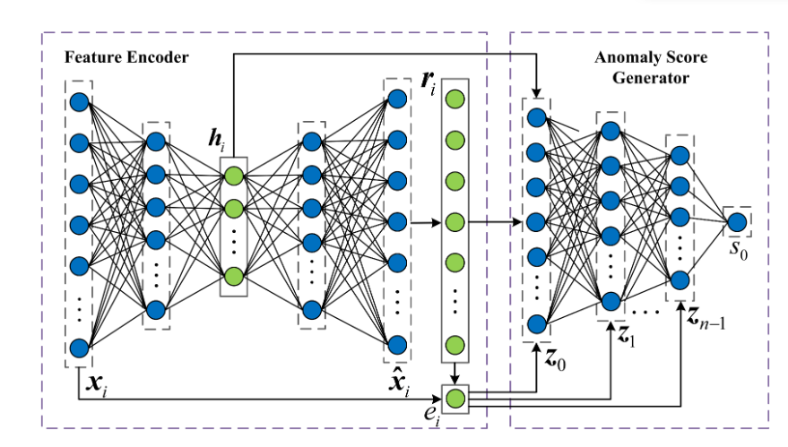

## 2024/3/14 
#### pytorch实现各类神经网络，使用mnist进行验证
- cnn
- rnn
- lstm
#### 正在完善的模型...
- transfomer
- AE

#### 注意事项
新数据库添加完成后，到data的__init__种加入DataFactory里
新模型都请继承BaseModel类，实现类的loss_function和metrics_function，然后加入ModelFactory里
然后修改run.py里的args参数即可运行

## pytorch实现异常检测模型
### 1、Feature_Encoding_with_AutoEncoders_for_Weakly-supervised_Anomaly_Detection
**问题：**
然而，由于标注的异常样本数量有限，直接训练具有判别性损失的网络可能是不够的

**想法：**
其核心思想是利用自动编码器，一种常用的无监督异常检测器，来拟合正常数据，然后从正常数据中提取特征表示，用于弱监督异常检测。
一种新颖的策略，将输入数据转化为更有意义的表示，可用于异常检测

**方法：**

自动编码器对输入数据进行编码，并利用三个因素，隐藏表示，重构残差向量和重构误差。

**贡献：**
- 我们引入了一种新的策略来对输入数据进行编码，从而构建了一种更有效的特征表示，可以用于异常检测。
    
- 基于我们的编码策略，我们提出了一个异常检测系统，它无缝地结合了所提出的编码中的信息。
    
- 我们在各种数据集上对所提出的方法进行了广泛的实验分析，并证明了我们方法的有效性。我们还进行了消融研究，以调查我们方法中各种成分的影响。
